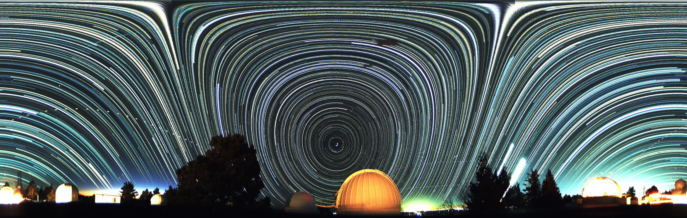

# unWrap
Unwrap allsky (fisheye) images into rectilinear in Python

Simple to use python script to unwrap an allsky or 360 deg RGB fisheye image into a panoramic rectilinear image.

Dependencies: 
imageio 
numpy 
opencv 

Tested:
Raspberry pi 3/4

# installation
sudo apt-get install python3-scipy 
sudo apt-get install python-opencv 
sudo pip3 install imageio 

# usage test.py
	from unWrap import unwrap
 	import imageio

 	image = imageio.imread('rgb.jpg')
 	result = unwrap(image, 40) #Here we are cropping 40px from the bottom of final pano. Set to 0 for disable.
 	imageio.imwrite('test.jpg', result)

